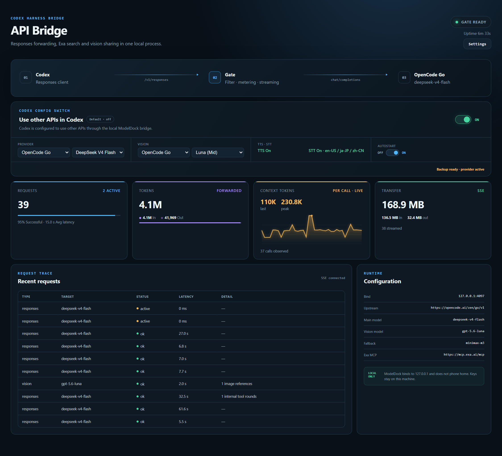

# ModelDock

Donnez a DeepSeek des yeux, des oreilles et une voix -- et gardez vos longues sessions jusqu'au bout.

<p align="center">
  <a href="README.md">English</a> ·
  <a href="README.zh-CN.md">中文</a> ·
  <a href="README.ja.md">日本語</a> ·
  <a href="README.es.md">Español</a>
</p>

<p align="center">
  
</p>

## Pourquoi ModelDock

**Multimedia**

DeepSeek V4 Flash est rapide et economique, mais il ne peut ni voir, ni parler, ni ecouter. ModelDock ajoute les trois d'un coup :

- **Voir** -- deposez une image dans Codex ; DeepSeek recoit une description (acheminee vers MiMo V2.5 Free, repli sur MiniMax M3)
- **Parler** -- l'outil `speak` convertit n'importe quel texte en fichier audio
- **Ecouter** -- l'outil `hear` retranscrit un fichier audio en texte

Activez la parole dans la tuile **TTS · STT** du tableau de bord ; le reglage est conserve d'une session a l'autre.

**Sessions longues**

ModelDock declare une fenetre de contexte de 250 k a Codex, ce qui declenche la compaction automatique integree a 80 %. Un verificateur de session relance le modele quand il se tait, pour qu'une longue tache de codage aille jusqu'au bout sans s'arreter en chemin.

## Installation

Windows :

```
powershell -ExecutionPolicy Bypass -c "irm https://raw.githubusercontent.com/architectds/modeldock/main/scripts/install.ps1 | iex"
```

macOS :

```
curl -fsSL https://raw.githubusercontent.com/architectds/modeldock/main/scripts/install.sh | sh
```

L'installateur verifie Node.js >= 22, telecharge ModelDock dans `~/.modeldock`, le lance en arriere-plan et ouvre le tableau de bord. Collez votre token [opencode.ai](https://opencode.ai/auth) dans la boite de dialogue Parametres qui s'ouvre.

## Connecter Codex

1. Ouvrez **http://127.0.0.1:4097** dans votre navigateur
2. Activez l'interrupteur sur la page
3. Fermez completement Codex puis relancez-le
4. Choisissez un modele ModelDock dans le selecteur de modeles de Codex

## Utilisation quotidienne

**Selecteur de modeles** -- tous les modeles accessibles apparaissent dans le selecteur de Codex (en bas a droite), etiquetes par source. Changez sans redemarrer.

**Gratuit en premier** -- choisissez `Auto - DeepSeek Free first`. ModelDock utilise le quota gratuit, bascule silencieusement sur le modele payant a l'epuisement, et retente le gratuit une heure plus tard.

**Parole** -- ouvrez la tuile TTS · STT dans le tableau de bord. Activez TTS une fois ; l'outil `speak` devient disponible pour le modele. STT correspond a `hear`.

**Langue de l'interface** -- le tableau de bord parle English, 简体中文, 日本語, Français, Español. Changez a tout moment dans Parametres -> Langue de l'interface.

**Demarrage automatique et mises a jour** -- activez le bouton Autostart ; ModelDock se lance en arriere-plan a chaque connexion. Un bouton vert Mettre a jour s'affiche quand une nouvelle version est disponible -- un clic telecharge, redemarre et recharge la page.
